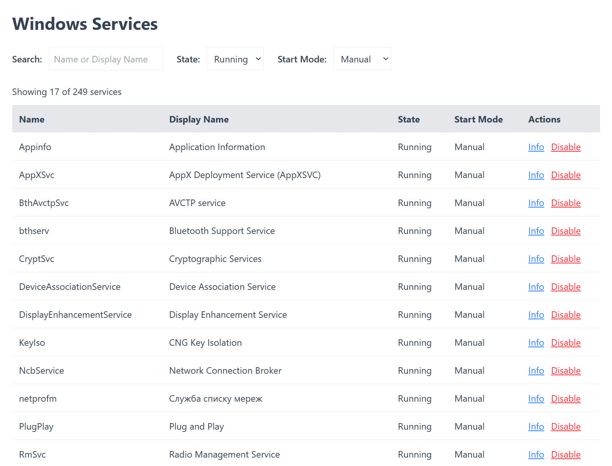

# Windows Fix


Run several scripts to improve the system

## Services Manager

Will show useful information about services on your PC

### Setup

- in `server` directory
  - Copy `.env.example` to `.env` and add your Grok API key:
    ```bash
    cp .env.example .env
    # Edit .env and set GROK_API_KEY=your_api_key_here
    ```
  - Get your Grok API key from [xAI Console](https://console.x.ai/)
  - run `bun i`
  - then `bun .\app.js`
- in `web` directory
  - run `bun i`
  - then `bun run dev`

### AI Features

The Services Manager now uses Grok AI to fetch information about unknown Windows services:

- When a service is not found in the local database, it queries Grok AI
- Falls back to web scraping if AI is unavailable
- Shows source of information (AI Generated vs Web Scraped)
- Stores AI responses in the local JSON database for future use



## Scripts

They can:

- explorer
  - set grouping to none
  - unpin useless folders
  - unpin network tab

```bash
Set-ExecutionPolicy -Scope CurrentUser -ExecutionPolicy RemoteSigned
```
