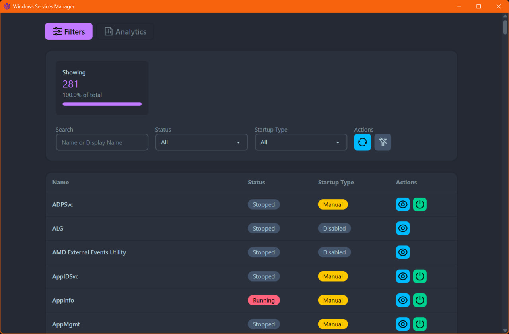
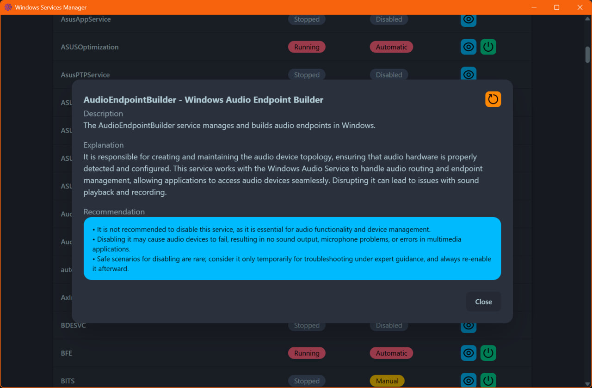
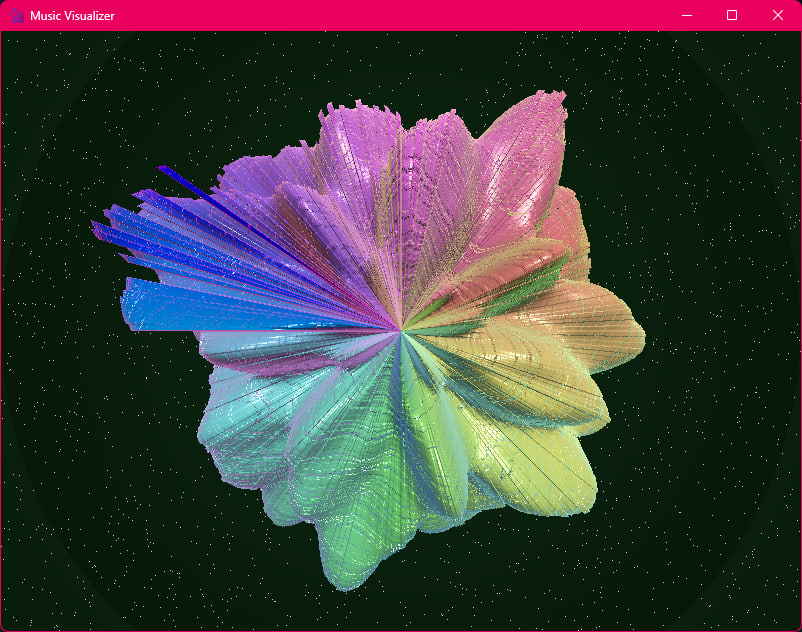
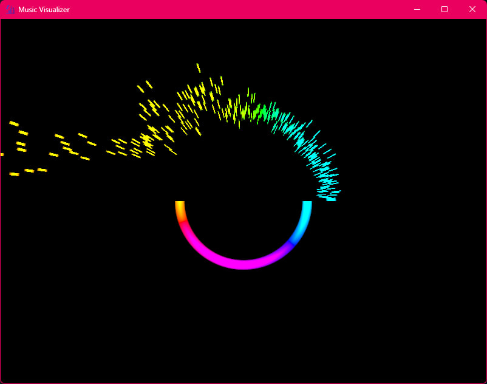
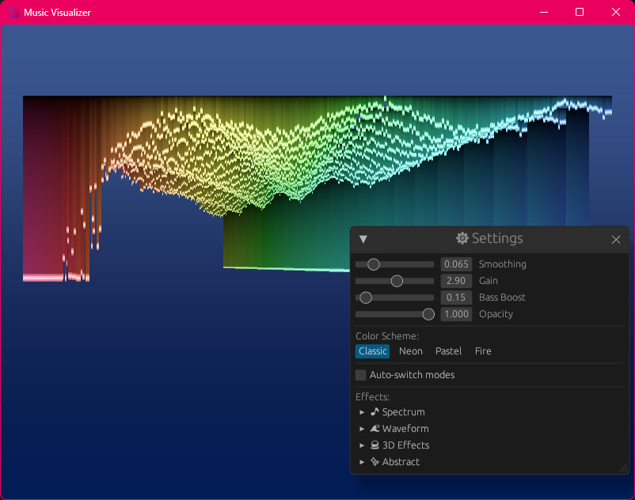

# Windows Fix

A collection of tools and scripts to fix and enhance Windows experience :)

## Services Manager (SM)

A Tauri + Vue3 application to manage Windows Services

With AI integration to help you understand what each service does and if safe to disable it

## Music Visualizer (MV)

A Rust application that visualises audio input in real-time using GPU-accelerated shaders (wgpu).

### Features

- Multiple visualisation modes (spectrum, waveform, bars, mandala, particles …)
- GPU particle system overlay
- Fullscreen support
- Window transparency toggle (Windows)
- Adjustable intensity

| plasma_sphere_3d | oscilloscope | depth_wave_3d |
|-------|-------|-------|
|  |  |  |

### Running

Select your audio input/output device when prompted – the visualiser window opens immediately

### Keyboard Controls

| Key | Action |
|-----|--------|
| `F1` | Toggle info panel |
| `F2` | Open settings |
| `F11` | Toggle fullscreen |
| `Space` / `M` | Switch visualization mode |
| `T` | Toggle transparency |
| `←` / `→` | Adjust opacity |
| `↑` / `↓` | Adjust intensity |
| `Esc` | Exit application |

> Press F1 to show controls.
