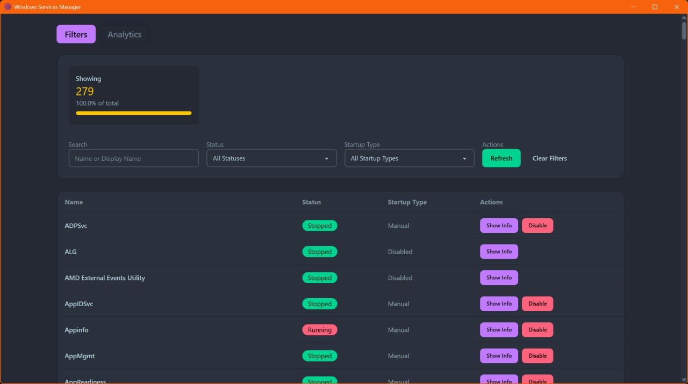

# Windows Fix


A collection of tools and scripts to fix and enhance Windows experience :)

## Services Manager

A Tauri + Vue3 application to manage Windows services



## Scripts

They can:

- explorer
  - set grouping to none
  - unpin useless folders
  - unpin network tab

```bash
Set-ExecutionPolicy -Scope CurrentUser -ExecutionPolicy RemoteSigned
```
