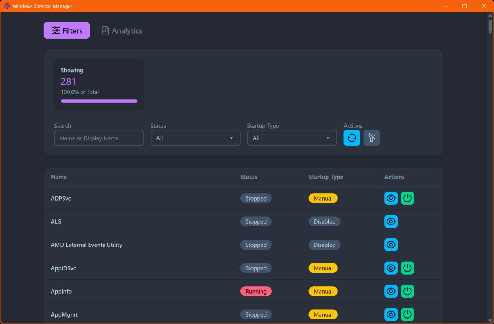
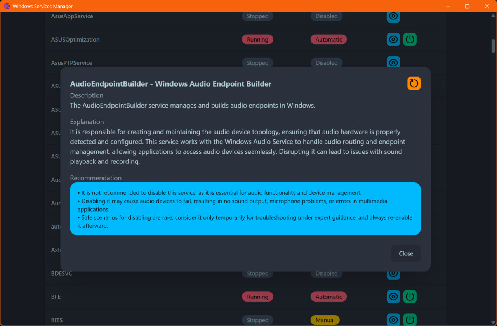
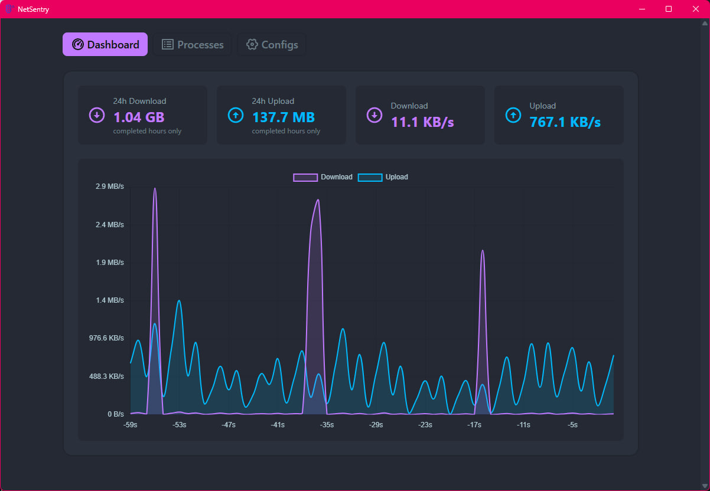
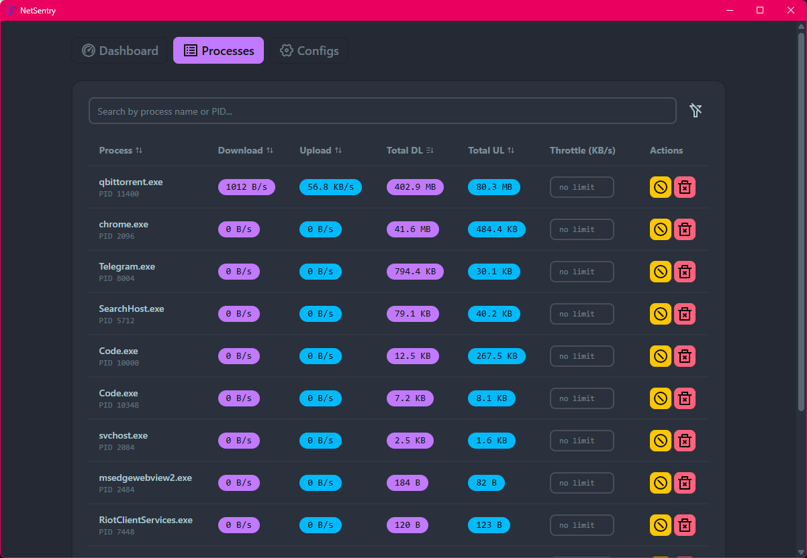
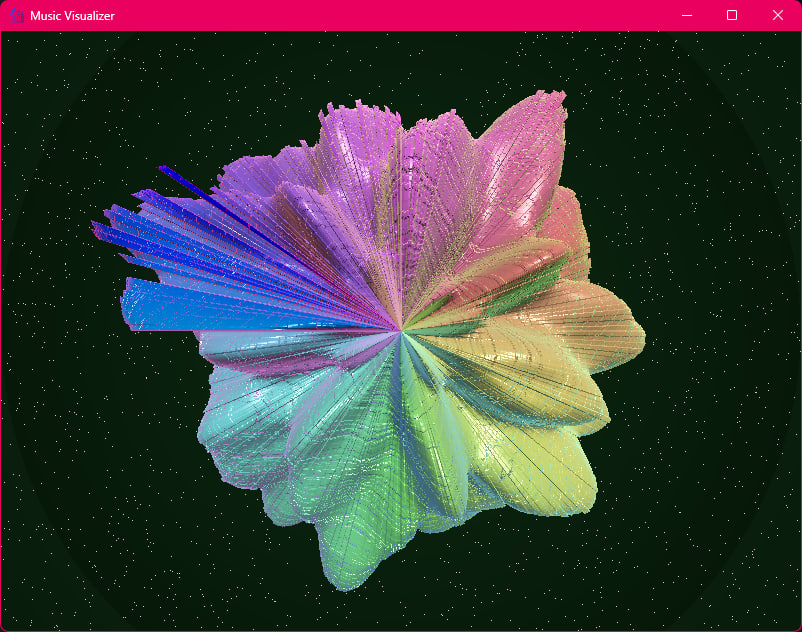
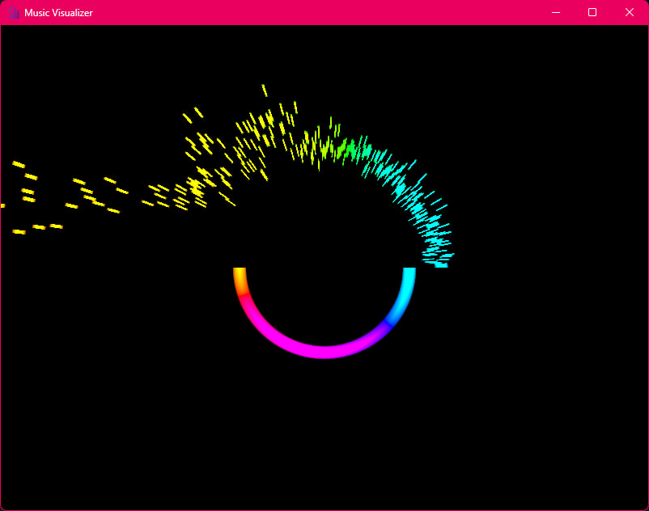
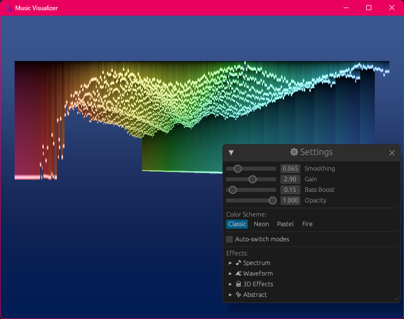

# Windows Fix

Collection of tools for enhancing the Windows experience :)

## Services Manager (SM)

A Tauri + Vue3 application to manage Windows Services

With AI integration to help you understand what each service does and if safe to disable it

| Services List | Service Details |
|-------|-------|
|  |  |

## Network Handler (NetSentry)

A Tauri + Vue3 application for real-time network monitoring and traffic shaping

### Features

- Real-time bandwidth monitoring and visualization
- Per-process traffic analysis and throttling
- Global speed limits and process-specific limits
- 24-hour usage history and statistics
- Process blocking and termination
- Configurable notifications for traffic thresholds
- Minimize to system tray functionality
- Dark theme with responsive design

| dashboard | processes |
|-------|-------|
|  |  |

### Dashboard

- Live download/upload speed tiles
- 24-hour total data consumption
- Interactive bandwidth chart

### Processes Tab

- Process list with sortable columns
- Detailed process information with PID
- Real-time and total bandwidth per process
- Throttling controls (KB/s limits)
- Block/unblock traffic
- Terminate processes
- Process detail modal with hourly history charts

### Configs Tab

- Global speed limit presets
- Notification settings (new process alerts, data thresholds)
- Application settings (start with Windows, minimize to tray)

### Running

Requires administrator privileges for network packet capture and traffic shaping.

## Music Visualizer (MV)

A Rust application that visualises audio input in real-time using GPU-accelerated shaders (wgpu).

### Features

- Multiple visualisation modes (spectrum, waveform, bars, mandala, particles …)
- GPU particle system overlay
- Fullscreen support
- Window transparency toggle (Windows)
- Adjustable intensity

| plasma_sphere_3d | oscilloscope | depth_wave_3d |
|-------|-------|-------|
|  |  |  |

### Running

Select your audio input/output device when prompted – the visualiser window opens immediately

### Keyboard Controls

| Key | Action |
|-----|--------|
| `F1` | Toggle info panel |
| `F2` | Open settings |
| `F11` | Toggle fullscreen |
| `Space` / `M` | Switch visualization mode |
| `T` | Toggle transparency |
| `←` / `→` | Adjust opacity |
| `↑` / `↓` | Adjust intensity |
| `Esc` | Exit application |

> Press F1 to show controls.
