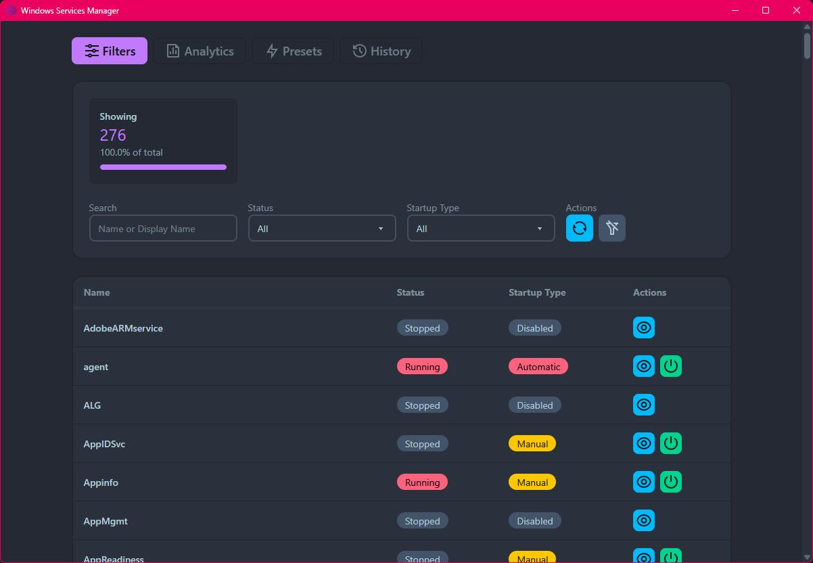
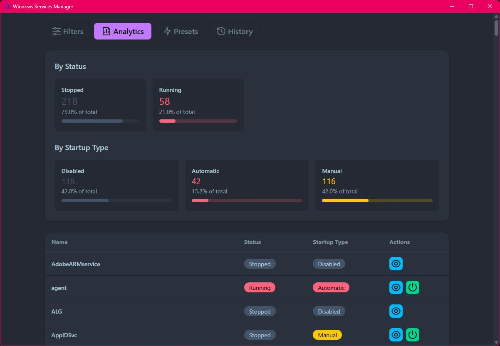
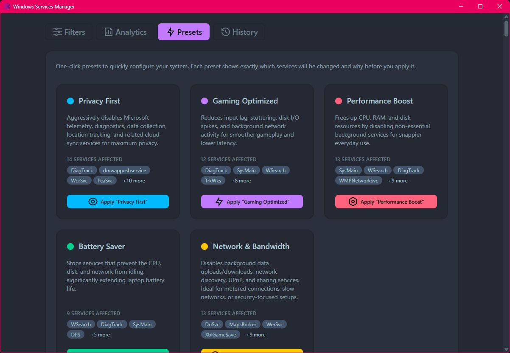
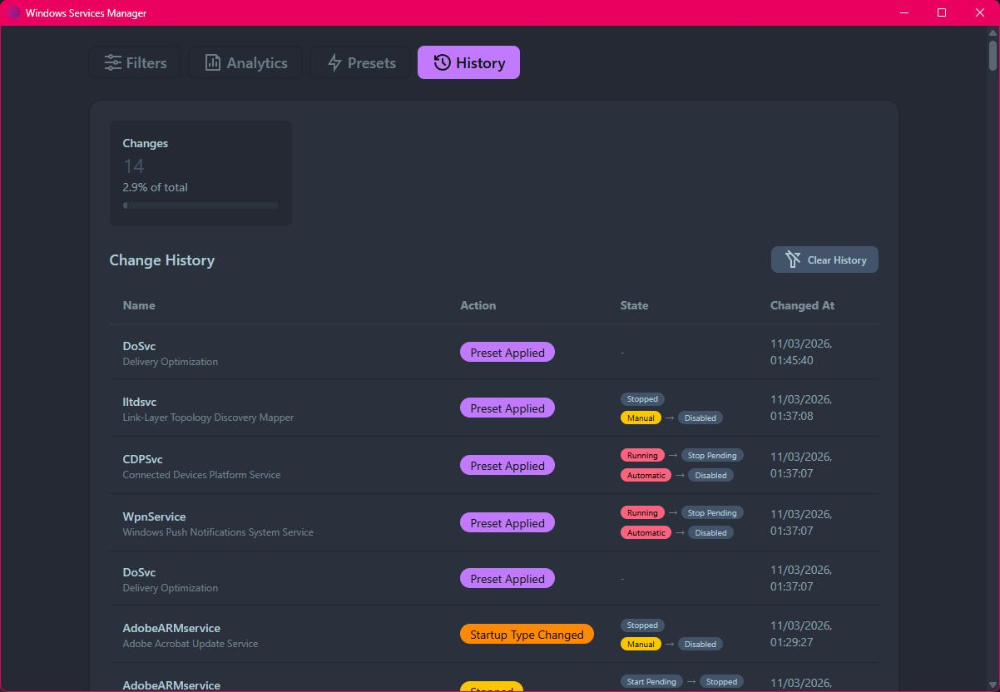
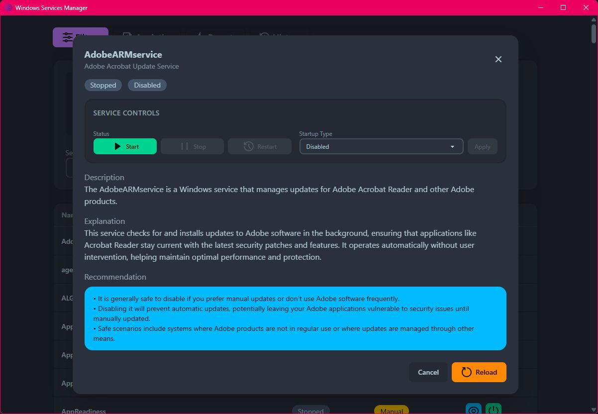
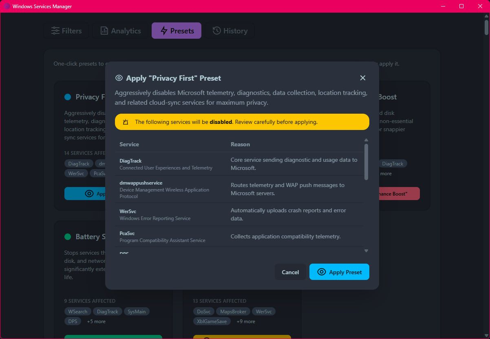
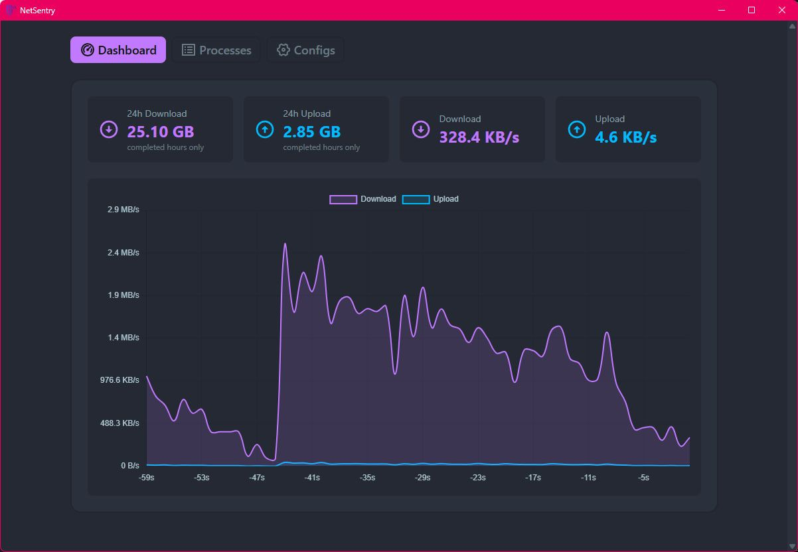
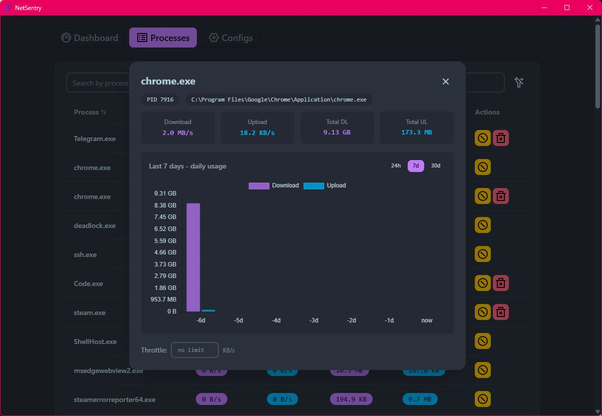
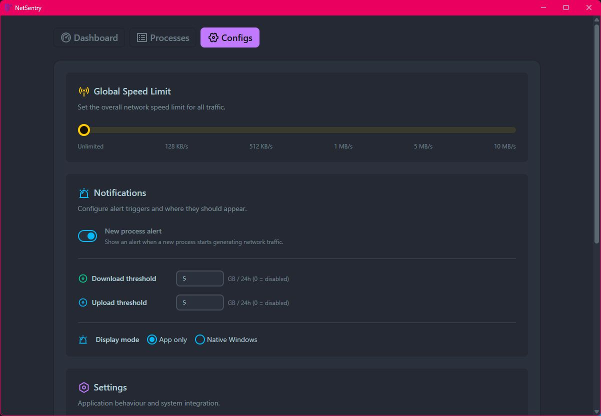
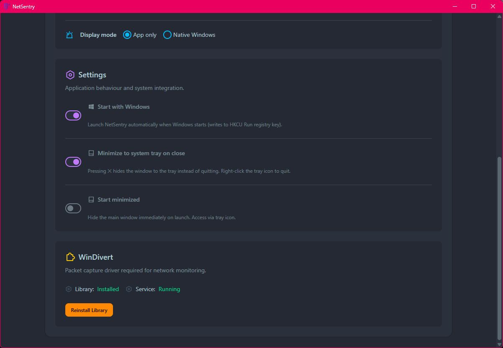

# Windows Fix

Collection of tools for enhancing the Windows experience :)

## Services Manager (SM)

Rust(Tauri) + Vue3 application to manage Windows Services

### Features

- Control service states and startup types
- **Presets** for quick configuration management
- Filtering and search capabilities
- Service details modal with full information and AI insights
- Service history tracking and analytics
- Dark theme with responsive design

### Tabs

- Filters
    - Complete list of Windows services with status indicators
    - Filter services by status, startup type, and name
    - Quick Actions: Start, stop, restart, disable, or enable services
    - Service details modal with AI-generated explanations
- Analytics
    - Services grouping insights
- Presets
    - Apply presets to quickly change multiple services' configurations
- History
    - Track changes made to services

| Filters | Analytics | Presets | History |
|-------|-------|-------|-------|
|  |  |  |  |

| Service Details Modal | Preset Application Confirmation |
|-------|-------|
|  |  |

## Network Handler (NetSentry)

A Tauri + Vue3 application for real-time network monitoring and traffic shaping

### Features

- Real-time network traffic statistics and process-level breakdown
- Traffic control: block, throttle, and terminate processes
- Notifications and alerts for new processes and data thresholds
- System tray integration with autorun options
- Advanced packet interception using WinDivert
- Persistent settings and SQLite-based storage
- Dark theme with responsive design

### Tabs

- Dashboard
    - Live network traffic statistics (download/upload speeds)
    - Process-level traffic breakdown with detailed per-application usage
    - 24-hour historical data tracking with hourly granularity and interactive charts
- Processes
    - View live bandwidth usage per application
    - Block network access for specific processes
    - Set custom bandwidth limits
    - Terminate processes directly from the interface
- Configs
    - Notification settings for new processes and data thresholds
    - Global bandwidth limits
    - Startup behavior (autorun, minimize to tray)
    - Data retention preferences

| dashboard | processes | configs | configs |
|-------|-------|-------|-------|
|  |  |  |  |

## Music Visualizer (MV)

A Rust application that visualises audio input in real-time using GPU-accelerated shaders (wgpu)

### Features

- Multiple visualisation modes (spectrum, waveform, bars, mandala, particles …)
- GPU particle system overlay
- GUI-based audio device selection with persistence
- Fullscreen support
- Window transparency toggle (Windows)
- Adjustable intensity, gain, and beat sensitivity
- Settings panel with color schemes and effect toggles
- Auto-switch modes with customizable intervals

> F1 - toggles info panel

| plasma_sphere_3d | oscilloscope | depth_wave_3d |
|-------|-------|-------|
|  |  |  |
